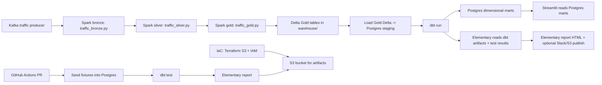

## Target outcomes

- dbt will materialize a dimensional model in Postgres: `dim_locations` and `fct_traffic_events` (plus lightweight compatibility views so the dashboard stays usable).
- Elementary will run on top of dbt test results and generate an observability report.
- Terraform will provision a minimal AWS S3 bucket + IAM roles so GitHub Actions can publish dbt/Elementary artifacts.
- GitHub Actions will run dbt tests on every PR using small seeded fixtures (fast CI), while local/full runs load from your Delta Gold tables.

## Where dbt hooks into your current Nexus

Your pipeline already produces Gold star-schema tables in Delta:

- `apps/traffic_gold.py` writes `fact_traffic`, `dim_zone`, `dim_road` under the Spark warehouse path (`/opt/spark/warehouse/...`).
- those map to the local `warehouse/` directory mounted by `docker-compose.yaml`.

```5:9:apps/traffic_gold.py
SILVER_PATH = "/opt/spark/warehouse/traffic_silver"
DIM_ZONE_PATH = "/opt/spark/warehouse/dim_zone"
DIM_ROAD_PATH = "/opt/spark/warehouse/dim_road"
FACT_TRAFFIC_PATH = "/opt/spark/warehouse/fact_traffic"
GOLD_CHECKPOINT = "/opt/spark/warehouse/chk/traffic_gold"
```

Your Streamlit dashboard currently reads those Gold paths directly via `deltalake`:

```93:103:dashboard/shared.py
@st.cache_data(show_spinner=False)
def load_delta_table(path: Path) -> pd.DataFrame:
    return DeltaTable(str(path)).to_pandas()

@st.cache_data(show_spinner=False)
def load_dashboard_data() -> pd.DataFrame:
    fact_df = load_delta_table(FACT_TRAFFIC_PATH)
    zone_df = load_delta_table(DIM_ZONE_PATH)
    road_df = load_delta_table(DIM_ROAD_PATH)
```

So Project 1 will mostly introduce a “Delta -> Postgres -> dbt -> Postgres” layer.

## Proposed architecture (end-to-end)




## Implementation plan (what changes in the repo)

### 1) Add a Postgres target for dbt

- Update `docker-compose.yaml` to add a dedicated Postgres container (e.g. `dbt-postgres`) for:
  - staging tables (loaded from Delta Gold)
  - marts produced by dbt (`analytics.dim_locations`, `analytics.fct_traffic_events`)
  - Elementary tables (e.g. `${schema}_elementary` and `elementary_test_results`).
- Document connection env vars in a new `dbt/.env.example` (e.g. `POSTGRES_HOST`, `POSTGRES_PORT`, `POSTGRES_DB`, `POSTGRES_USER`, `POSTGRES_PASSWORD`).

### 2) Create a Delta -> Postgres loader

- Add `scripts/load_gold_delta_to_postgres.py` that:
  - reads your Delta Gold tables from the *local* `warehouse/` directory (the same ones Streamlit uses today)
  - writes them to Postgres staging tables, for dbt sources:
    - `stg_dim_zone`
    - `stg_dim_road`
    - `stg_fact_traffic`
- Keep typing explicit (create tables with SQLAlchemy/DDL before inserting) so dbt tests are stable.

### 3) Scaffold dbt project

Add a new top-level directory `dbt/` containing:

- `dbt_project.yml`
- `profiles.yml` template (do NOT commit secrets; commit a template)
- `models/` with:
  - `staging/` (source definitions pointing at `stg_`* tables)
  - `marts/dim_locations.sql`
  - `marts/fct_traffic_events.sql`
  - optional compatibility views `views/fact_traffic.sql`, `views/dim_zone.sql`, `views/dim_road.sql` so the existing dashboard logic can stay close to the current one.
- `models/<model_name>/schema.yml` for:
  - dbt generic tests: `not_null`, `unique`, `accepted_values`, `relationships`
  - compliance metadata: a `gdpr_pii_classification` meta tag on every column.

Dimensional model design (aligned to your existing Gold columns):

- `dim_locations` grain: unique `(city_zone, road_id)` pairs.
- `fct_traffic_events` grain: unique `(vehicle_id, event_ts)` events from your current `fact_traffic`.
- Deterministic keys:
  - `event_id = md5(vehicle_id || '|' || event_ts)`
  - `location_id = md5(city_zone || '|' || road_id)`

Accepted-value test sources will come from your generator:

```20:22:producer/traffic_data_producer.py
roads = ["R100", "R200", "R300", "R400"]
zones = ["CBD", "AIRPORT", "TECHPARK", "SUBURB", "TRAINSTATION"]
weather = ["CLEAR", "RAIN", "FOG", "STORM"]
```

### 4) Add Elementary observability

- Add Elementary dbt package to `dbt/packages.yml` (and run `dbt deps`).
- Configure Elementary PII-sample protection in `dbt/dbt_project.yml`:
  - enable `vars.disable_samples_on_pii_tags: true`
  - set `vars.pii_tags` to include `gdpr_pii_classification`.
- Add a simple run/report script:
  - `scripts/run_elementary_report.sh` that runs:
    - `dbt run --select elementary`
    - `dbt test`
    - `edr monitor`
    - `edr report --file-path edr_target/report.html`

Elementary commands reference:

- CLI uses `edr report`, `edr monitor`, and supports `--file-path` for report artifacts.

### 5) Switch Streamlit dashboard to Postgres

- Modify `dashboard/shared.py`:
  - replace `load_delta_table()` with `load_postgres_table()`
  - update `load_dashboard_data()` to pull from dbt-produced tables/views.
- Prefer compatibility views so dashboard transformations (groupbys, charts) remain stable:
  - if dashboard expects `fact_traffic`/`dim_zone`/`dim_road` columns, expose Postgres views with the same column names.

### 6) CI/CD with GitHub Actions (dbt test + Elementary report)

Because `warehouse/` is gitignored, CI should not rely on Delta being present:

```14:16:.gitignore
# Local data and generated Spark artifacts
warehouse/
```

So the PR workflow will:

- start a Postgres service (GitHub Actions `services:` or docker compose)
- seed staging tables from small fixture CSVs in-repo (add `dbt/fixtures/` or `tests/fixtures/`)
- run:
  - `dbt deps`
  - `dbt run --select elementary` (create Elementary tables)
  - `dbt test`
  - `edr report` (store HTML as a workflow artifact)

Create 2 workflows:

- `.github/workflows/dbt-ci.yml`: runs dbt + Elementary on `pull_request`.
- `.github/workflows/terraform-plan.yml`: runs `terraform fmt` + `terraform validate` + `terraform plan` on `pull_request` (no apply).

### 7) Terraform: minimal AWS S3 + IAM

Add `infra/terraform/` containing Terraform code that provisions:

- an S3 bucket for publishing CI artifacts (Elementary report HTML)
- an IAM role for GitHub Actions (OIDC) with least-privilege `s3:PutObject` to that bucket

Wiring:

- The dbt CI workflow uploads `edr_target/report.html` to the Terraform-provisioned bucket.

## Deliverables you can point to in interviews

- A `dbt/` project with dimensional modeling and tests.
- Column-level compliance metadata (`gdpr_pii_classification`) across dbt models.
- Elementary report artifacts on PRs.
- Terraform module + GitHub Actions OIDC-based deployment capability.
- Dashboard switched to dbt/Postgres outputs, demonstrating end-to-end usefulness.

