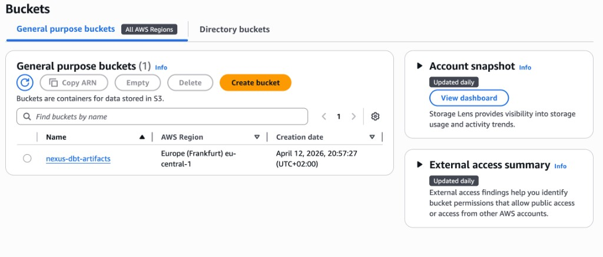

# Nexus Traffic Lakehouse

End-to-end traffic analytics pipeline built with Kafka, Spark Structured Streaming, Delta Lake, dbt, and a Streamlit dashboard — from raw streaming ingestion through a tested dimensional warehouse to an operational analytics UI.

## Why I Built This

Urban traffic data is noisy, fast-moving, and difficult to use directly for analytics. Raw streaming events are not enough for decision-making because they need validation, structure, and business-friendly models before they can support monitoring or dashboards.

I built this project to solve that problem end to end:

- ingest live traffic events in real time
- process them through a Lakehouse architecture
- transform them into clean analytical tables
- validate data quality automatically with dbt tests
- expose them in a dashboard that is easy to explore

The goal was to show how raw streaming data can become something useful — and trustworthy — for operational traffic analysis.

## Problem Statement

This project simulates live traffic data, processes it through Bronze, Silver, and Gold layers, builds a tested dimensional warehouse with dbt, and serves a dashboard for operational monitoring and analytics.

Pipeline flow:

`Kafka -> Bronze Delta -> Silver Delta -> Gold Delta -> Postgres staging -> dbt warehouse -> Streamlit Dashboard`

## What This Project Does

- Real-time traffic ingestion with Kafka
- Bronze layer for raw streaming capture
- Silver layer for validation, typing, deduplication, and feature engineering
- Gold layer for star-schema style analytics tables (Delta Lake)
- Warehouse layer with dbt:
  - dimensional model: `dim_locations` and `fct_traffic_events`
  - 28 data tests: uniqueness, not_null, accepted_values, foreign key relationships
  - GDPR PII classification meta tags on every column
  - Elementary observability for test monitoring and reporting
- Streamlit dashboard reading from the tested dbt warehouse:
  - KPI overview
  - zone activity map
  - congestion and road analysis
  - weather and speed insights
  - zone and road drill-down page
- CI/CD with GitHub Actions:
  - dbt tests + Elementary report on every pull request
  - Terraform plan validation on infrastructure changes
- Infrastructure as Code with Terraform:
  - S3 bucket for CI artifacts
  - IAM roles with GitHub Actions OIDC (no static credentials)

## Repo Structure

```text
apps/                         Spark jobs for bronze, silver, and gold layers
dashboard/                    Streamlit app and dashboard pages
dbt/                          dbt project: models, tests, seeds, Elementary
  models/marts/               Dimensional models (dim_locations, fct_traffic_events)
  models/views/               Compatibility views for the dashboard
  models/marts/schema.yml     Tests and GDPR PII meta tags
  seeds/                      CI fixture data for automated testing
  packages.yml                Elementary dbt package
infra/terraform/              Terraform: S3 bucket + IAM OIDC for GitHub Actions
scripts/                      Loader and Elementary report scripts
.github/workflows/            CI: dbt-ci.yml and terraform-plan.yml
docs/images/                  Screenshots used in the GitHub README
hive-conf/                    Hive metastore configuration
producer/                     Kafka traffic producer
sql/                          SQL setup scripts
docker-compose.yaml           Local infrastructure: Spark, Kafka, Hive, Postgres
```

## Architecture

The project follows a streaming Lakehouse architecture from ingestion to a tested warehouse and analytics layer.

### Architecture Diagram



### Architecture Flow

1. `producer/traffic_data_producer.py` sends simulated traffic events to Kafka.
2. `apps/traffic_bronze.py` consumes Kafka and stores raw Delta data.
3. `apps/traffic_silver.py` cleans and enriches Bronze data into Silver.
4. `apps/traffic_gold.py` builds Gold analytical tables: `fact_traffic`, `dim_zone`, `dim_road`.
5. `scripts/load_gold_delta_to_psql.py` loads Gold Delta tables into Postgres staging tables.
6. `dbt run` builds the dimensional warehouse: `dim_locations`, `fct_traffic_events`, and compatibility views.
7. `dbt test` validates all 28 data quality tests.
8. `dashboard/app.py` reads the tested dbt warehouse tables and serves the UI.

## Warehouse Layer

After Gold tables land in Delta, dbt builds a proper dimensional model on top of them in Postgres.

### Why I added dbt

The Gold Delta tables are good for the streaming pipeline, but they have no built-in way to validate the data. If a bad batch lands, nothing catches it. dbt adds a layer of automated testing so the data that reaches the dashboard is always validated.

### What dbt builds

- `dim_locations` — one row per unique (city_zone, road_id) pair with zone and road attributes joined in. 20 rows.
- `fct_traffic_events` — one row per traffic event with a `location_id` foreign key. 512 rows in the latest run.
- Compatibility views (`fact_traffic`, `dim_zone`, `dim_road`) so the dashboard reads from the warehouse without breaking its existing column contract.

### Data tests (28 total)

- Uniqueness: `location_id`, `event_id`
- Not null: every column in both models
- Accepted values: `city_zone`, `road_id`, `traffic_risk`, `weather`, `speed_band`
- Relationships: `fct_traffic_events.location_id` references `dim_locations.location_id`

### GDPR compliance metadata

Every column has a `gdpr_pii_classification` meta tag. The only column marked as PII is `vehicle_id` (pseudonymous identifier). Elementary uses these tags to automatically suppress sample data from test failure reports for PII columns.

### Elementary observability

Elementary runs on top of dbt test results and generates an HTML observability report. In CI, this report is uploaded as a GitHub Actions artifact on every pull request.

## Result

The final result is a working local traffic analytics platform with:

- streaming ingestion from Kafka
- Lakehouse processing across Bronze, Silver, and Gold
- a tested dimensional warehouse built with dbt
- 28 automated data quality tests passing on every run
- GDPR-aware column metadata
- a Streamlit dashboard reading from the validated warehouse
- CI/CD that validates every change before merge
- infrastructure provisioned with Terraform

## Dashboard

The dashboard is built with Streamlit and reads from the dbt warehouse tables in Postgres.

### Pages

- `Overview`: KPI cards, zone map, hourly pulse, top roads, weather impact
- `Zone and Road Explorer`: zone drill-down, road pressure, heatmap, leaderboard

## Screenshots

### Overview Dashboard


### Map View


### Explorer Page


## Run Locally

### 1. Start infrastructure

```bash
docker compose up -d
```

This starts Kafka, Spark (master + worker), Hive metastore, and two Postgres databases (one for Hive, one for the dbt warehouse).

### 2. Run Bronze

```bash
docker exec spark-master /opt/spark/bin/spark-submit \
  --master spark://spark-master:7077 \
  --jars /tmp/.ivy/jars/io.delta_delta-spark_2.12-3.2.0.jar,/tmp/.ivy/jars/io.delta_delta-storage-3.2.0.jar,/tmp/.ivy/jars/org.apache.spark_spark-sql-kafka-0-10_2.12-3.5.1.jar,/tmp/.ivy/jars/org.apache.spark_spark-token-provider-kafka-0-10_2.12-3.5.1.jar,/tmp/.ivy/jars/org.apache.kafka_kafka-clients-3.4.1.jar,/tmp/.ivy/jars/org.apache.commons_commons-pool2-2.11.1.jar,/tmp/.ivy/jars/org.apache.hadoop_hadoop-client-runtime-3.3.4.jar,/tmp/.ivy/jars/org.apache.hadoop_hadoop-client-api-3.3.4.jar,/tmp/.ivy/jars/org.xerial.snappy_snappy-java-1.1.10.3.jar \
  /opt/spark-apps/traffic_bronze.py
```

### 3. Produce data

```bash
./venv/bin/python producer/traffic_data_producer.py
```

### 4. Run Silver

```bash
docker exec spark-master /opt/spark/bin/spark-submit \
  --master spark://spark-master:7077 \
  --jars /tmp/.ivy/jars/io.delta_delta-spark_2.12-3.2.0.jar,/tmp/.ivy/jars/io.delta_delta-storage-3.2.0.jar \
  /opt/spark-apps/traffic_silver.py
```

### 5. Run Gold

```bash
docker exec spark-master /opt/spark/bin/spark-submit \
  --master spark://spark-master:7077 \
  --jars /tmp/.ivy/jars/io.delta_delta-spark_2.12-3.2.0.jar,/tmp/.ivy/jars/io.delta_delta-storage-3.2.0.jar \
  /opt/spark-apps/traffic_gold.py
```

### 6. Load Gold into Postgres

```bash
python scripts/load_gold_delta_to_psql.py
```

### 7. Run dbt

```bash
cd dbt
pip install dbt-postgres elementary-data
dbt deps
dbt run
dbt test
```

### 8. Run dashboard

```bash
pip install -r requirements-dashboard.txt
streamlit run dashboard/app.py
```

Open `http://localhost:8501`.

### Optional: Generate Elementary report

```bash
./scripts/run_elementary_report.sh
```

This generates an HTML observability report at `edr_target/report.html`.

## CI/CD

### dbt CI (every pull request)

GitHub Actions automatically:
1. Starts a Postgres service container
2. Seeds fixture data (no Spark needed in CI)
3. Runs `dbt run` and `dbt test`
4. Generates an Elementary report and uploads it as a PR artifact

### Terraform Plan (on infrastructure changes)

When files under `infra/terraform/` change, GitHub Actions runs `terraform fmt`, `validate`, and `plan` using OIDC-based AWS authentication.

### Terraform-provisioned S3 bucket



The `nexus-dbt-artifacts` bucket in `eu-central-1` (Frankfurt) is provisioned by Terraform and stores Elementary observability reports uploaded by CI. Public access is blocked and versioning is enabled.

## Key Tables

Delta (streaming pipeline):
- `warehouse/traffic_bronze`
- `warehouse/traffic_silver`
- `warehouse/fact_traffic`
- `warehouse/dim_zone`
- `warehouse/dim_road`

Postgres (dbt warehouse):
- `analytics.dim_locations`
- `analytics.fct_traffic_events`
- `analytics.fact_traffic` (view)
- `analytics.dim_zone` (view)
- `analytics.dim_road` (view)

## What I Would Improve Next

- Add real geographic coordinates instead of representative zone centroids
- Support near real-time dashboard refresh
- Add anomaly detection tests with Elementary (volume, freshness)
- Add a DataHub catalogue for automated lineage visualization
- Deploy to AWS with Terraform (MSK for Kafka, EMR Serverless for Spark)

## Tech Stack

- Apache Kafka
- Apache Spark 3.5
- Delta Lake
- Hive Metastore
- PostgreSQL
- dbt Core
- Elementary (data observability)
- Terraform
- GitHub Actions
- Python
- SQL
- Streamlit
- Plotly
- Docker Compose

## Notes

- Generated data in `warehouse/` is intentionally ignored from Git.
- Connection env vars for the dbt Postgres are documented in `.env.example`.
- Run the full pipeline (Bronze through dbt) before opening the dashboard.
