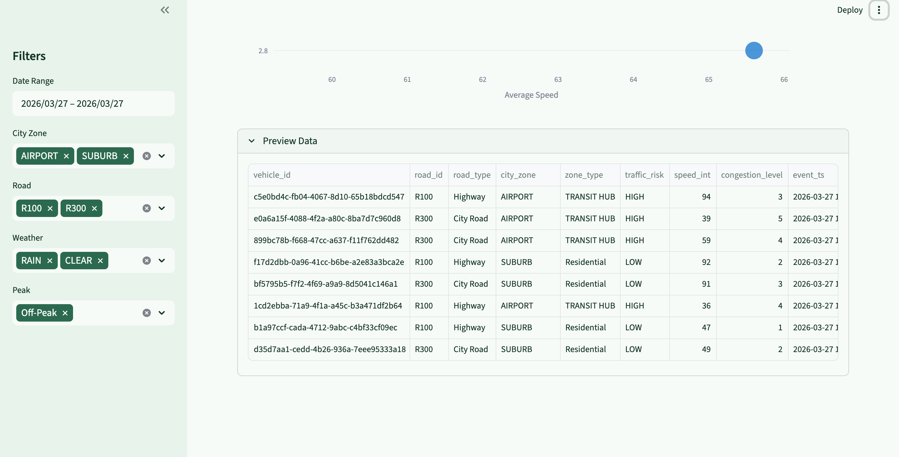
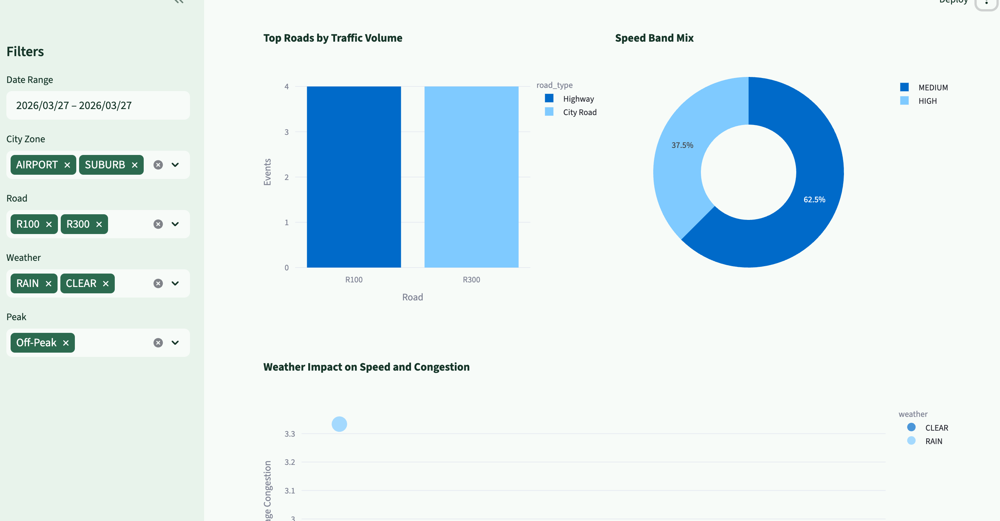
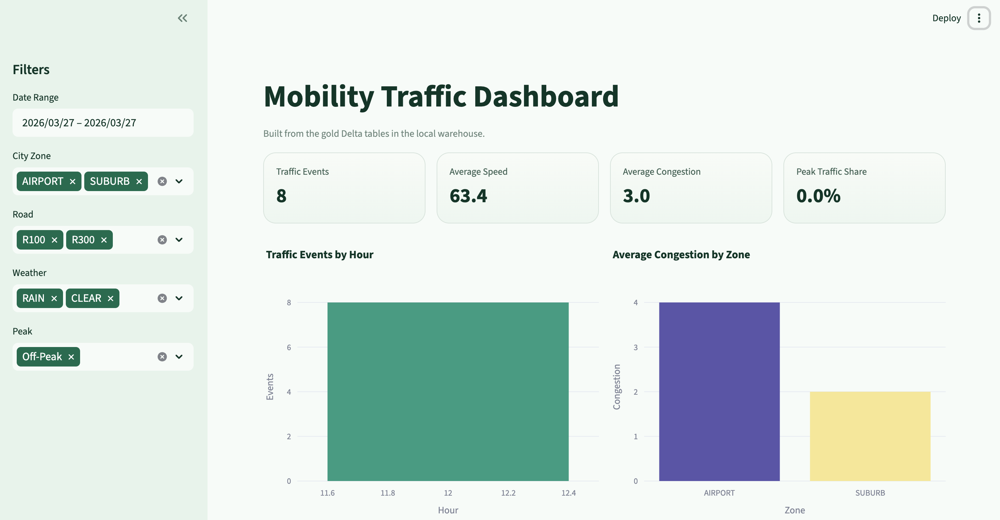
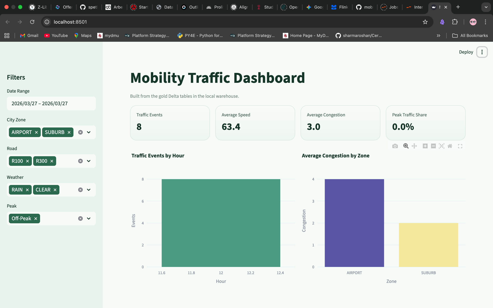

# Nexus Traffic Lakehouse

End-to-end traffic analytics pipeline built with Kafka, Spark Structured Streaming, Delta Lake, and a Streamlit dashboard.

## Why I Built This

Urban traffic data is noisy, fast-moving, and difficult to use directly for analytics. Raw streaming events are not enough for decision-making because they need validation, structure, and business-friendly models before they can support monitoring or dashboards.

I built this project to solve that problem end to end:

- ingest live traffic events in real time
- process them through a Lakehouse architecture
- transform them into clean analytical tables
- expose them in a dashboard that is easy to explore

The goal was to show how raw streaming data can become something useful for operational traffic analysis.

## Problem Statement

This project simulates live traffic data, processes it through Bronze, Silver, and Gold layers, and serves a dashboard for operational monitoring and analytics.

Pipeline flow:

`Kafka -> Bronze Delta -> Silver Delta -> Gold Delta -> Streamlit Dashboard`

## What This Project Does

- Real-time traffic ingestion with Kafka
- Bronze layer for raw streaming capture
- Silver layer for validation, typing, deduplication, and feature engineering
- Gold layer for star-schema style analytics tables
- Streamlit dashboard with:
  - KPI overview
  - zone activity map
  - congestion and road analysis
  - weather and speed insights
  - zone and road drill-down page

## Repo Structure

```text
apps/                 Spark jobs for bronze, silver, and gold layers
dashboard/            Streamlit app and dashboard pages
docs/images/          Screenshots used in the GitHub README
hive-conf/            Hive metastore configuration
producer/             Kafka traffic producer
sql/                  SQL setup scripts
docker-compose.yaml   Local infrastructure for Spark, Kafka, and Hive metastore
```

## Architecture

The project follows a streaming Lakehouse architecture from ingestion to analytics.

### Architecture Diagram


### Editable Architecture Source

An editable Mermaid version is also included here:

- `docs/architecture.mmd`

### Architecture Flow

1. `producer/traffic_data_producer.py` sends simulated traffic events to Kafka.
2. `apps/traffic_bronze.py` consumes Kafka and stores raw Delta data.
3. `apps/traffic_silver.py` cleans and enriches Bronze data into Silver.
4. `apps/traffic_gold.py` builds Gold analytical tables:
   - `fact_traffic`
   - `dim_zone`
   - `dim_road`
5. `dashboard/app.py` reads the Gold Delta tables and serves the UI.

## Result

The final result is a working local traffic analytics platform with:

- streaming ingestion from Kafka
- Lakehouse processing across Bronze, Silver, and Gold
- Gold analytical tables ready for reporting
- a Streamlit dashboard with:
  - KPI overview
  - zone activity map
  - congestion monitoring
  - road performance analysis
  - weather impact insights
  - zone and road drill-down views

This means the project does not stop at data engineering. It goes all the way to a usable analytics layer.

## Dashboard

The dashboard is built with Streamlit and reads directly from the local Gold Delta tables.

### Pages

- `Overview`: KPI cards, zone map, hourly pulse, top roads, weather impact
- `Zone and Road Explorer`: zone drill-down, road pressure, heatmap, leaderboard

## Screenshots

This is how the dashboard output is shown in the repository on GitHub. GitHub renders these directly from the `docs/images/` folder through normal Markdown image links in this README.






## Run Locally

### 1. Start infrastructure

```bash
docker compose up -d
```

### 2. Run Bronze

```bash
docker exec spark-master /opt/spark/bin/spark-submit \
  --master spark://spark-master:7077 \
  --jars /tmp/.ivy/jars/io.delta_delta-spark_2.12-3.2.0.jar,/tmp/.ivy/jars/io.delta_delta-storage-3.2.0.jar,/tmp/.ivy/jars/org.apache.spark_spark-sql-kafka-0-10_2.12-3.5.1.jar,/tmp/.ivy/jars/org.apache.spark_spark-token-provider-kafka-0-10_2.12-3.5.1.jar,/tmp/.ivy/jars/org.apache.kafka_kafka-clients-3.4.1.jar,/tmp/.ivy/jars/org.apache.commons_commons-pool2-2.11.1.jar,/tmp/.ivy/jars/org.apache.hadoop_hadoop-client-runtime-3.3.4.jar,/tmp/.ivy/jars/org.apache.hadoop_hadoop-client-api-3.3.4.jar,/tmp/.ivy/jars/org.xerial.snappy_snappy-java-1.1.10.3.jar \
  /opt/spark-apps/traffic_bronze.py
```

### 3. Produce data

```bash
./venv/bin/python producer/traffic_data_producer.py
```

### 4. Run Silver

```bash
docker exec spark-master /opt/spark/bin/spark-submit \
  --master spark://spark-master:7077 \
  --jars /tmp/.ivy/jars/io.delta_delta-spark_2.12-3.2.0.jar,/tmp/.ivy/jars/io.delta_delta-storage-3.2.0.jar \
  /opt/spark-apps/traffic_silver.py
```

### 5. Run Gold

```bash
docker exec spark-master /opt/spark/bin/spark-submit \
  --master spark://spark-master:7077 \
  --jars /tmp/.ivy/jars/io.delta_delta-spark_2.12-3.2.0.jar,/tmp/.ivy/jars/io.delta_delta-storage-3.2.0.jar \
  /opt/spark-apps/traffic_gold.py
```

### 6. Run dashboard

```bash
./venv/bin/pip install -r requirements-dashboard.txt
./venv/bin/streamlit run dashboard/app.py
```

Open `http://localhost:8501`.

## Key Tables

- `warehouse/traffic_bronze`
- `warehouse/traffic_silver`
- `warehouse/fact_traffic`
- `warehouse/dim_zone`
- `warehouse/dim_road`

## What I Would Improve Next

If I continued this project, the next upgrades would be:

- add real geographic coordinates instead of representative zone centroids
- support near real-time dashboard refresh
- add alerting for congestion spikes and abnormal traffic patterns
- improve gold modeling with richer dimensions and historical trends
- add orchastration layer with more automated testing and monitoring/alerting


## Tech Stack

- Apache Kafka
- Apache Spark 3.5
- Delta Lake
- Hive Metastore
- Python
- SQL
- Streamlit
- Plotly
- Docker Compose

## Notes

- Generated data in `warehouse/` is intentionally ignored from Git.
- Run Gold before opening the dashboard so the latest star-schema tables exist.
